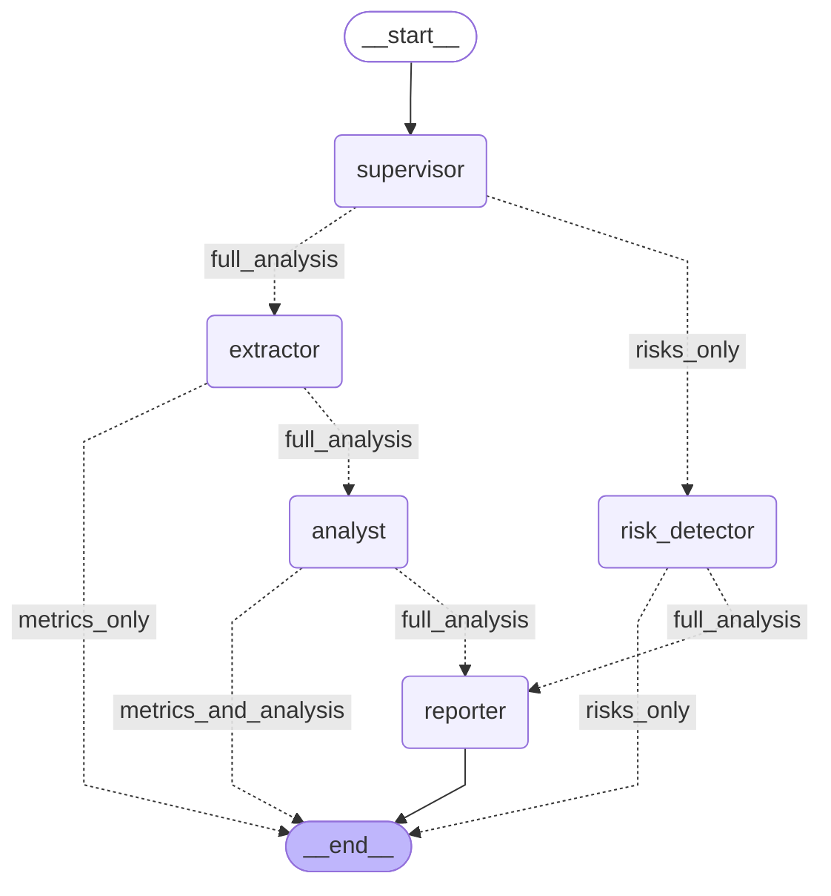

```mermaid

---
config:
  flowchart:
    curve: linear
---
graph TD;
        __start__([<p>__start__</p>]):::first
        supervisor(supervisor)
        extractor(extractor)
        analyst(analyst)
        risk_detector(risk_detector)
        reporter(reporter)
        __end__([<p>__end__</p>]):::last
        __start__ --> supervisor;
        analyst -. &nbsp;metrics_and_analysis&nbsp; .-> __end__;
        analyst -. &nbsp;full_analysis&nbsp; .-> reporter;
        extractor -. &nbsp;metrics_only&nbsp; .-> __end__;
        extractor -. &nbsp;full_analysis&nbsp; .-> analyst;
        risk_detector -. &nbsp;risks_only&nbsp; .-> __end__;
        risk_detector -. &nbsp;full_analysis&nbsp; .-> reporter;
        supervisor -. &nbsp;full_analysis&nbsp; .-> extractor;
        supervisor -. &nbsp;risks_only&nbsp; .-> risk_detector;
        reporter --> __end__;
        classDef default fill:#f2f0ff,line-height:1.2
        classDef first fill-opacity:0
        classDef last fill:#bfb6fc
```